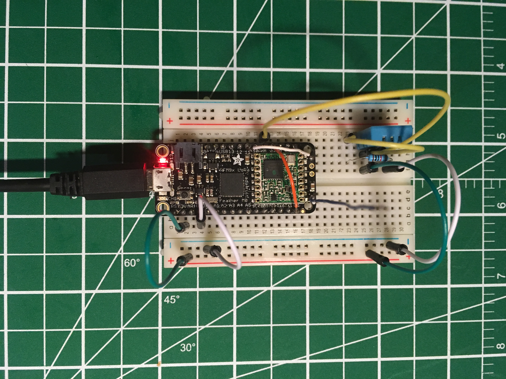
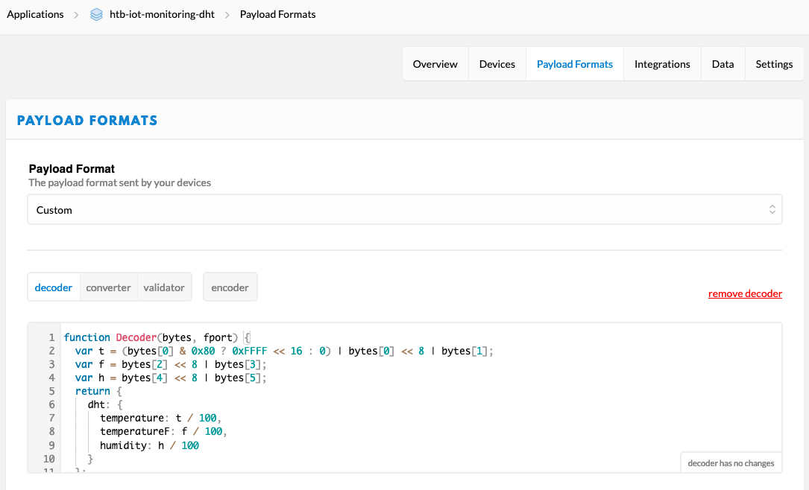
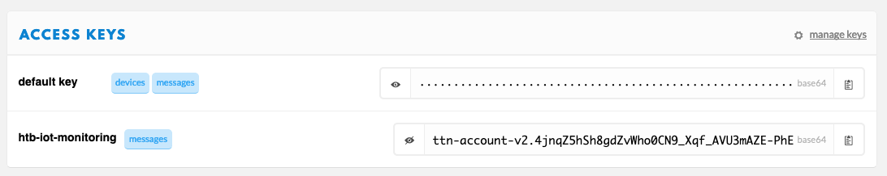
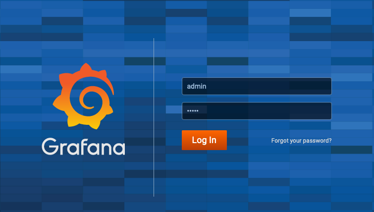
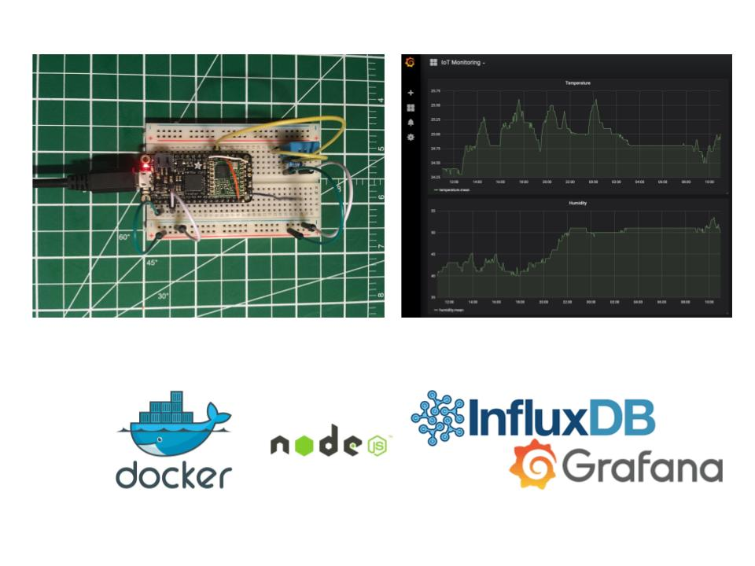

# IoT Monitoring - The Things Network

Environment monitoring with The Things Network, InfluxDB, and Grafana

> [Tomas Hrdlicka](https://tomas.hrdlicka.co.uk) & [HackTheBase](https://hackthebase.com) - [UCW Labs Ltd.](https://ucwlabs.com)

- [Resources](#resources)
- [Workshop](#workshop)
- [Exercises](#exercises)
  - [LoRa Sensor Node with DHT sensor](#lora-sensor-node-with-dht-sensor)
    - How to collect data from the DHT sensor and send it to The Things Network
  - [TTN Bridge (Node.js)](#ttn-bridge-nodejs)
    - Reading data from The Things Network via MQTT and storing them in the InfluxDB
  - [Grafana](#grafana)
    - How to configure the data source in the Grafa to access data from the InfluxDB and how to create a simple 
      dashboard showing temperature and humidity data

## Resources
* [Slides](https://drive.google.com/open?id=1eniaB84t7fcsx1t2sj50CuGhhJn-p38l)
* [Video](https://youtu.be/StEHYDk_lVw)
* [Adafruit Feather M0 Radio with Lora Radio Module](https://learn.adafruit.com/adafruit-feather-m0-radio-with-lora-radio-module)
* [Sensor - DHT11](https://www.adafruit.com/product/386)
* [Sensor - DHT12](https://www.adafruit.com/product/385)
* [Sensor - BME280](https://www.adafruit.com/product/2652)
* [The Things Network Console](https://console.thethingsnetwork.org)
* [The Things Network API - MQTT](https://www.thethingsnetwork.org/docs/applications/mqtt/api.html)
* [The Things Network SDK - Node.js](https://www.thethingsnetwork.org/docs/applications/nodejs/quick-start.html)
* [Get started with Docker](https://docs.docker.com/get-started)
* [Nodejs](https://nodejs.org/en/)
* [NPM](https://www.npmjs.com/)

## Workshop
Thanks for taking the workshop IoT Monitoring for [The Things Network](https://thethingsnetwork.org) at 
[HackTheBase IoT Garage](https://www.meetup.com/hackthebase-iothub-vancouver/events/264577787/).

You can watch the video recording of the workshop on [YouTube](https://youtu.be/StEHYDk_lVw).

- We provide workshops and courses for various technologies:
  - IoT (Arduino, Particle, LoRaWAN, ...)
  - Web (Java, .NET, JavaScript, C/C++)
  - DevOps (Docker Swarm, Kubernetes, GitLab, Zabbix, Grafana, PostgreSQL)
  - and more.

List of available workshops you can find at [https://hackthebase.com/workshops](https://hackthebase.com/workshops)

Do you need a private workshop or course? [Contact us](https://ucwlabs.com/display/home#contact)

## Exercises

Clone (or download and unzip) the repository

```	
$ git clone https://github.com/ucwlabs/iot-monitoring-ttn.git
$ chmod +x run.sh
```

### LoRa Sensor Node with DHT sensor



#### LIBRARIES

Ensure the following libraries have been installed:

Arduino libraries:  	
* [Adafruit Unified Sensor](https://github.com/adafruit/Adafruit_Sensor)
* [DHT sensor](https://github.com/adafruit/DHT-sensor-library)
* [Adafruit BME280](https://github.com/adafruit/Adafruit_BME280_Library)
	
by taking the following steps:  
* Go to: Sketch -> Include Library -> Manage Libraries...
* enter the libraries above in the search bar and install  

#### INCLUDE THE NECESSARY LIBRARIES
Include the following files below
```
#include <lmic.h>
#include <hal/hal.h>
#include <SPI.h>
#include <DHT.h>
```

#### DECLARE DHT PIN AND TYPE AND CREATE OBJECT
  
Provide the I/O pin that is connected to the DHT PIN 2 (data pin) and DHT type
```
#define DHTPIN 9
#define DHTTYPE DHT11
```
Create DHT object
```
DHT dht(DHTPIN, DHTTYPE);
```

#### FOR ABP, PROVIDE NWKSKEY, APPSKEY, DEVADDR
  
```
// LoRaWAN NwkSKey - Network session key
static const PROGMEM u1_t NWKSKEY[16] = { 0x00, 0xFB, 0xA7, 0xBC, 0x12, 0x16, 0x35, 0x12, 0x9C, 0x42, 0xEC, 0x48, 0xE1, 0x59, 0xB7, 0x7E };

// LoRaWAN AppSKey - Application session key
static const u1_t PROGMEM APPSKEY[16] = { 0xEC, 0x0A, 0x3C, 0x05, 0x9F, 0xD4, 0xDA, 0x68, 0xBE, 0xF4, 0xA4, 0xD7, 0xA6, 0xFD, 0xB8, 0x46 };

// LoRaWAN end-device address (DevAddr)
static const u4_t DEVADDR = 0x260117E8; // <-- Change this address for every node!
```

#### READING THE DATA

Read and collect data from the sensor or any device as defined by the user

```
void readDHT(byte data[]) {
  // Read humidity
  float humidity = dht.readHumidity();
  // Read temperature as Celsius (the default)
  float temperature = dht.readTemperature();
  // Read temperature as Fahrenheit (isFahrenheit = true)
  float temperatureInFahrenheit = dht.readTemperature(true);

  int16_t t = temperature * 100;
  int16_t h = humidity * 100;
  int16_t f = temperatureInFahrenheit * 100;

  data[0] = highByte(t);
  data[1] = lowByte(t);
  data[2] = highByte(f);
  data[3] = lowByte(f);
  data[4] = highByte(h);
  data[5] = lowByte(h);
}
```

#### SINGLE OR MULTI-CHANNEL GATEWAY

The gateway, by default, operates using multi-channel communication mode. If the user wants to test single-channel 
communication, use the line below for the [setup method](https://www.arduino.cc/reference/en/language/structure/sketch/setup/). 
You can find the installation guide for single-channel gateway 
[here](https://www.hackster.io/ChrisSamuelson/lora-raspberry-pi-single-channel-gateway-cheap-d57d36).

```
// for Europe
for (int i = 1; i <= 8; i++) LMIC_disableChannel(i);

// for North America
for (int i = 1; i <= 71; i++) LMIC_disableChannel(i);
```

#### PAYLOAD  FORMAT

Use the decoder functions below as payload function at the [TTN console](https://console.thethingsnetwork.org) 
for DHT and BME280 examples respectively

DHT Sensor
```
function Decoder(bytes, fport) {
  var t = (bytes[0] & 0x80 ? 0xFFFF << 16 : 0) | bytes[0] << 8 | bytes[1];
  var f = bytes[2] << 8 | bytes[3];
  var h = bytes[4] << 8 | bytes[5];
  return {
    dht: {
      temperature: t / 100,
      temperatureF: f / 100,
      humidity: h / 100
    }
  };
}
```
BME280 Sensor
```
function Decoder(bytes, fport) {
  var t = (bytes[0] & 0x80 ? 0xFFFF << 16 : 0) | bytes[0] << 8 | bytes[1];
  var h = bytes[2] << 8 | bytes[3];
  return {
    bme280: {
      temperature: t / 100,
      humidity: h / 100
    }
  };
}
```

The resultant payload in JSON format for the DHT sensor can be seen below:


#### FULL EXAMPLE
  
The full code for the LoRa Sensor Node with DHT Sensor can be found 
[here](https://github.com/ucwlabs/iot-monitoring-ttn/blob/master/lora-sensor-node-dht/lora-sensor-node-dht.ino).

### TTN Bridge (Node.js)

#### Install Docker and Docker Compose

* [Get started with Docker Desktop for Windows](https://docs.docker.com/docker-for-windows)
* [Get started with Docker Desktop for Mac](https://docs.docker.com/docker-for-mac)

#### Install Node.js

1 How to install Node.js on Windows

* Go to the site [https://nodejs.org/en/download/](https://nodejs.org/en/download/) and download the necessary binary files.
  In our example, we are going to download the 64-bit setup files for Node.js (.msi package).
* Follow instructions on the screen.

2 How to install Node.js on macOS

```
$ /usr/bin/ruby -e "$(curl -fsSL https://raw.githubusercontent.com/Homebrew/install/master/install)"
$ brew -v
$ brew install node
$ node -v
$ npm -v
```

* [How to install NodeJS and NPM on Mac using Homebrew](https://www.dyclassroom.com/howto-mac/how-to-install-nodejs-and-npm-on-mac-using-homebrew)

#### Libraries

```
$ cd ttn-bridge
$ npm install
```

#### Update the AccessKey for your TTN Application

```
$ nano app.js
```

```
const appId = "htb-iot-monitoring-dht";
const accessKey = "your_access_key";
```
* Go to: Applications -> htb-iot-monitoring-dht , and scroll to the bottom of the page to see access keys 


#### Run TTN Bridge

```	
$ ./run.sh
$ docker ps -a
$ docker container logs -f ttn-bridge
```

### Grafana

Open web browser and go to [http://localhost:3000](http://localhost:3000)
* Username: admin
* Password: admin



Follow instruction from [slides](https://drive.google.com/open?id=1eniaB84t7fcsx1t2sj50CuGhhJn-p38l) (pages # 16-21)
to configure the [data source](https://grafana.com/docs/features/datasources/influxdb/) 
for [InfluxDB](https://www.influxdata.com/products/influxdb-overview/) 
and [dashboard](https://grafana.com/docs/guides/getting_started/).


